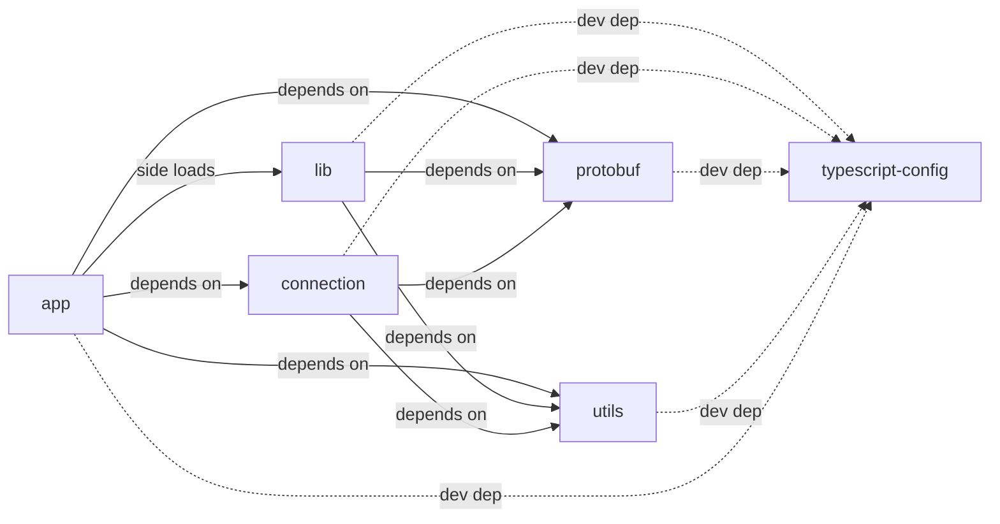

# Streamlit Frontend

## What is Streamlit Frontend?

Streamlit Frontend is a set of frontend packages tied to behaviors that make up a Streamlit App. Originally, Streamlit Frontend was a monolith, but we have since found unique ways to inject Streamlit behavior in multiple different products.

## Packages

The following are packages:

- **app** - The Streamlit app layout (used to bundle into Streamlit library)
- **connection** - Code to establish the Websocket connection
- **lib** - Right now, this is a catchall, but this is being refactored to be more focused. Namely, it supports a Streamlit "View" that contains elements, widgets, and layouts.
- **protobuf** - Our protobuf code in one library.
- **typescript-config** - configuration for typescript across all the packages.
- **utils** - some shared utils used across Streamlit

## Getting Started

The dependency diagram below describes the interaction between the packages. In particular, three packages need to be pre-built to develop actively:

- connection
- protobuf
- utils

You can run these after `yarn install` in the frontend directory with:

```
make frontend-dependencies
```

From their, assuming you do not plan to actively change the underlying libraries, you can continue active development with `yarn start` in the `frontend` directory.

### Making changes to dependent libraries

If you make a change in any of the dependent libraries, there are three ways:

**EASIEST - Run `make frontend-dev`**

This command will do the following:

1. Build Frontend Dependencies
2. Run `yarn dev` in the `frontend` which concurrently runs `yarn buildWatch` in dependent directories and `yarn start` in @streamlit/app.

This is the most foolproof, but it can duplicate efforts (e.g. what if the frontend dependencies were already built)

**SOMEWHAT EASY - Run `yarn dev` in the `frontend` directory**

This sidesteps the frontend dependencies requirement assuming you've handled this on your own.

**ADVANCED - Run `yarn buildWatch` in the dependent library directory** (or `yarn workspace @streamlit/WORKSPACE buildWatch` in the `frontend` directory).

This minimizes the CPU in investigating other packages, but it requires knowledge of the dependency chain in ensuring proper package dependencies are managed.

## Dependency Diagram



## License

Streamlit is completely free and open-source and licensed under the [Apache 2.0](https://www.apache.org/licenses/LICENSE-2.0) license.
